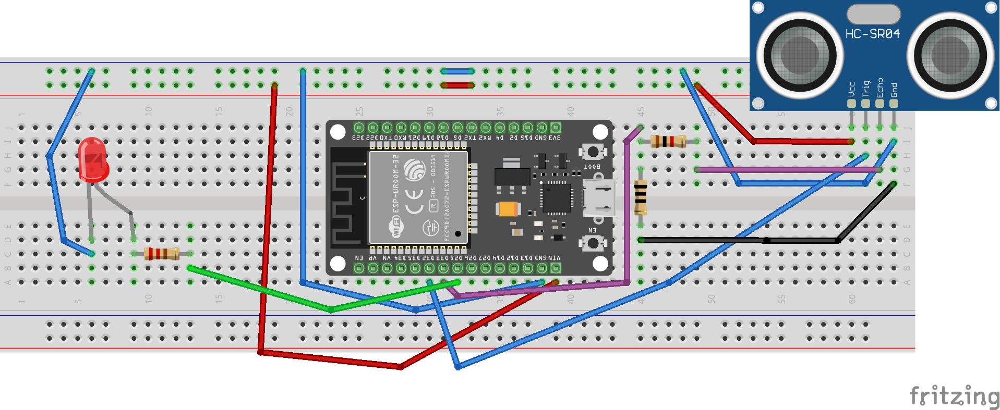
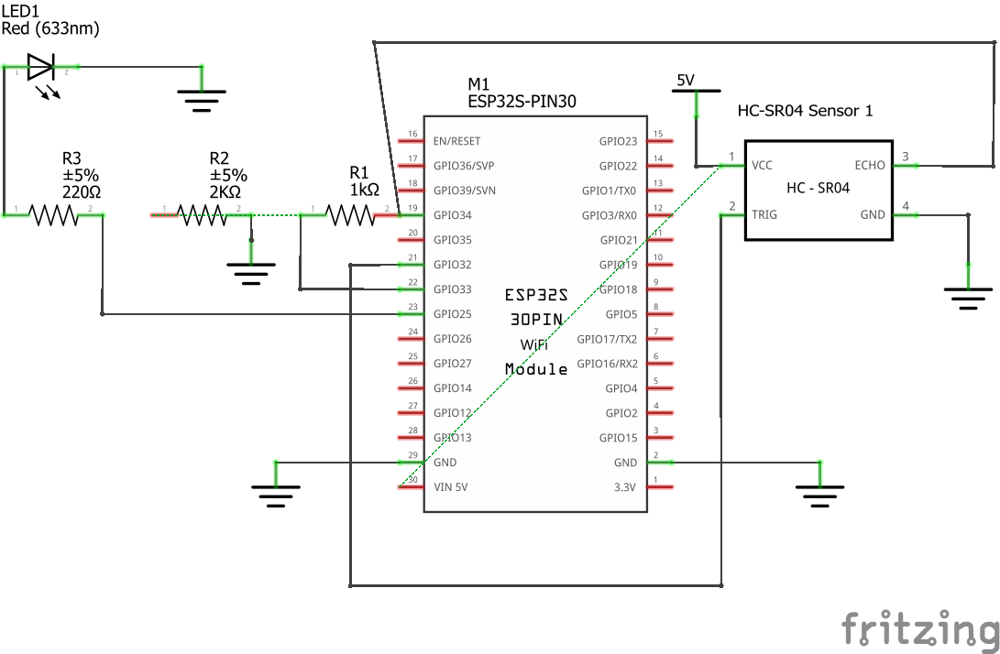
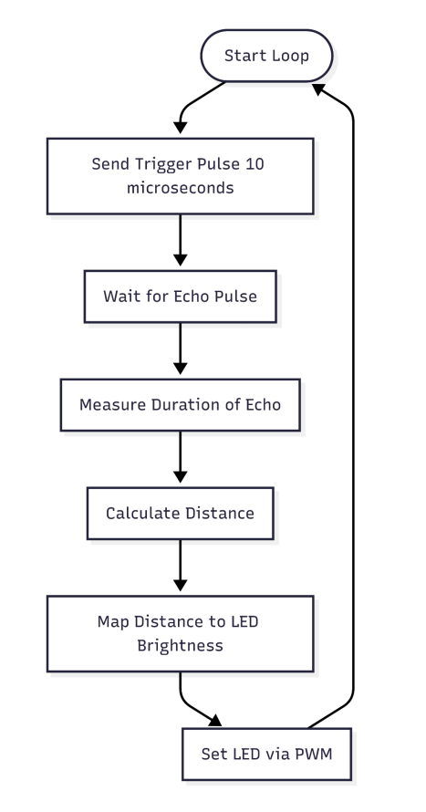
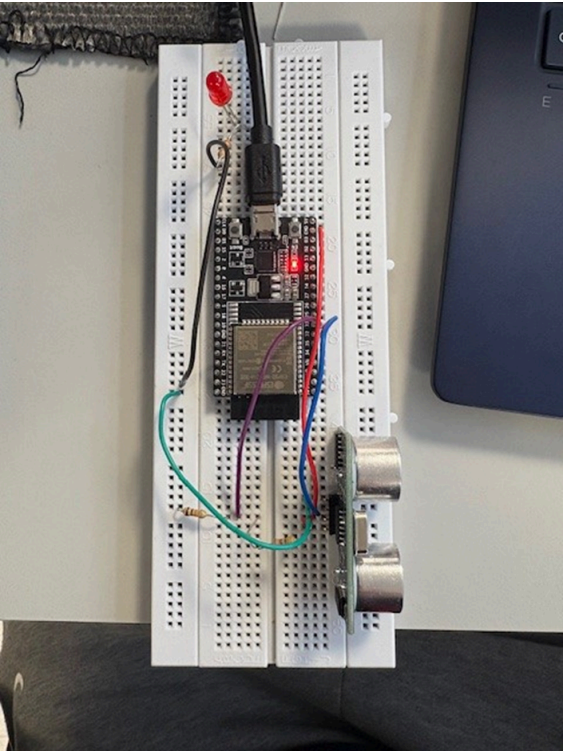

# Ultrasonic Distance Sensor (ESP32 + HC-SR04)

Measure distance with an **HC-SR04** and map it to **LED brightness** (PWM) on an **ESP32 DevKit V1**.  
Includes clean wiring, simple filtering, and a safe 5 V → 3.3 V level shift for the ECHO pin.

---

## Demo / Images

---

## Hardware
- **ESP32 DevKit V1 (30-pin)**
- **HC-SR04** ultrasonic sensor (**5 V** supply)
- **LED** + **220–330 Ω** series resistor
- **ECHO level shifter:** **R1 = 1 kΩ** (series), **R2 = 2 kΩ** (to GND) → node ≈ **3.3 V**
- Breadboard + jumpers

### Pin map
| Signal | ESP32 GPIO | Notes |
|-------:|:-----------|:------|
| TRIG   | **32**     | ESP32 → HC-SR04 TRIG |
| ECHO   | **33**     | HC-SR04 ECHO → **R1 1 kΩ → node → GPIO33** and **node → R2 2 kΩ → GND** |
| LED    | **25**     | **GPIO25 → 220–330 Ω → LED anode**; LED cathode → GND |
| Power  | **VIN/5V**, **GND** | HC-SR04 VCC = 5 V; common ground |

---

## How it works
1. **Trigger:** 10 µs pulse on TRIG.  
2. **Echo timing:** measure ECHO high-time (µs).  
3. **Distance:** `cm ≈ echo_us / 58.2`.  
4. **Filter:** moving average of **N = 5** samples (`FILTER_SAMPLES`).  
5. **Brightness:** map **10–100 cm → PWM 255–0** on GPIO25 (near = brighter, far = dimmer).

**Level shifting:** `Vnode = 5 × (R2 / (R1 + R2)) = 5 × (2k / 3k) ≈ 3.33 V` → safe for ESP32 GPIO33.

---

## Build & run
- **IDE:** Arduino IDE (ESP32 core)  
- **Board:** *ESP32 DevKit V1* / *ESP32 Dev Module*  
- **Library:** `NewPing`  
- **Serial:** 115200 baud

~~~text
ultrasonic-distance-sensor/
├─ ultrasonic-distance-sensor.ino
├─ docs/
│  ├─ breadboard.png
│  ├─ schematic.png
│  ├─ flowchart.png
│  ├─ photo.jpg
│  └─ wiring.fzz
├─ LICENSE
└─ .gitignore
~~~

---

## Code overview
- Pins & tunables: `TRIG=32`, `ECHO=33`, `LED=25`, `FILTER_SAMPLES=5`, `MAX_DISTANCE=400` cm.  
- Loop: trigger → read echo via `NewPing::ping_cm()` → moving average → map **10–100 cm** to **PWM 255–0** → drive LED.  
- Out-of-range: invalid pings ignored/clamped; LED off when invalid/very far.

~~~cpp
#define TRIG_PIN        32
#define ECHO_PIN        33
#define LED_ULTRA       25
#define MAX_DISTANCE    400
#define FILTER_SAMPLES  5

unsigned int currentDistance = sonar.ping_cm();  // 0 if no echo
int ledBrightness = map(filteredDistance, 10, 100, 255, 0);
analogWrite(LED_ULTRA, ledBrightness);
~~~

---

## Results / notes
- **N=5** smoothing removed jitter without obvious lag.  
- Usable range ~**10–100 cm**; very close/soft targets can miss—handled by clamping.

---

## What I learned
- **Power & level shifting:** HC-SR04 at **5 V**; **1 kΩ/2 kΩ** divider drops ECHO to ~**3.33 V** for GPIO33.  
- **Noise vs. responsiveness:** **moving average (N=5)** balanced smoothness and latency; mapped **10–100 cm → 255–0 PWM**.  
- **Wiring practicalities:** ESP32 DevKit is wide—straddled breadboard trench and fanned-out tight pins; verified LED truly **in series**.

---

## Credits
- Uses **NewPing** library for ultrasonic timing.

## License
MIT
